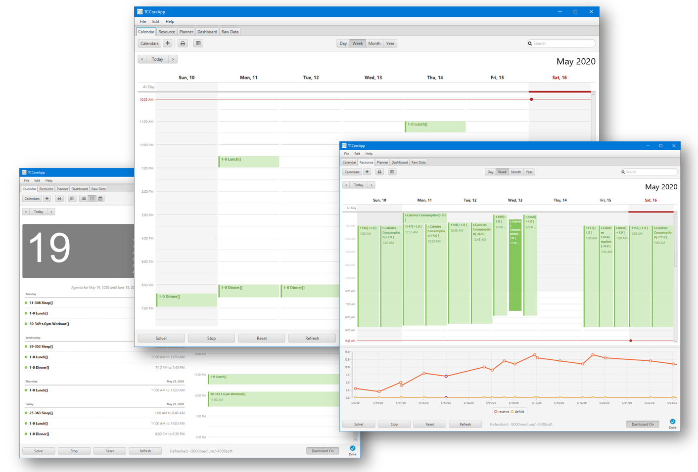
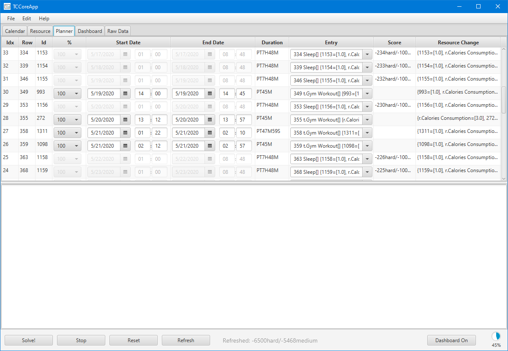
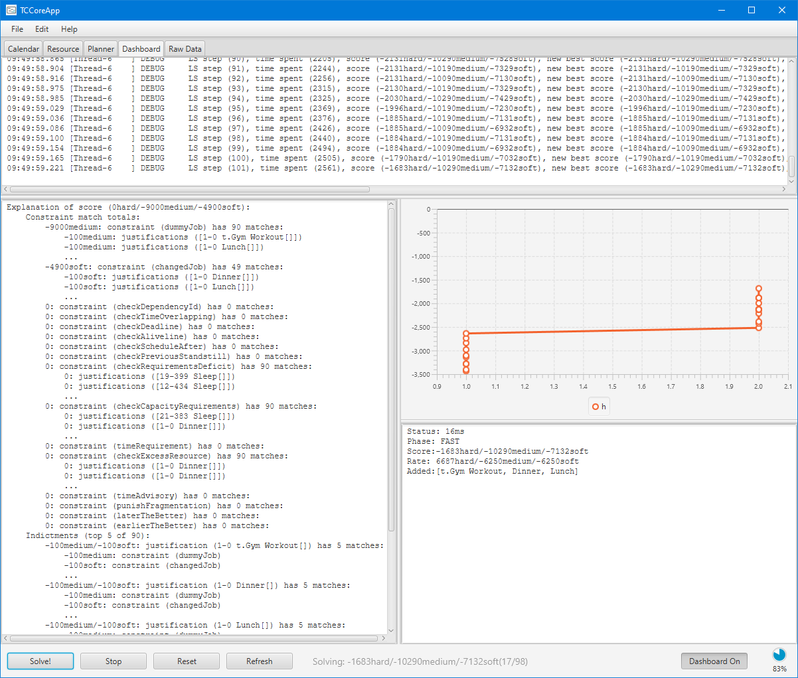
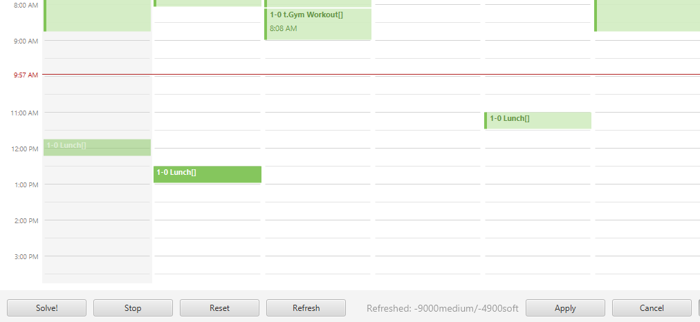

# tcPlanner: A Constraint-Based Time Blocking Planner
## Table of Contents

- [tcPlanner: A Constraint-Based Time Blocking Planner](#tcplanner-a-constraint-based-time-blocking-planner)
  - [Table of Contents](#table-of-contents)
  - [About The Project](#about-the-project)
  - [Requirements](#requirements)
  - [Getting Started](#getting-started)
    - [Installation](#installation)
    - [Usage](#usage)
      - [Running the application](#running-the-application)
      - [Providing a draft to the planner](#providing-a-draft-to-the-planner)
    - [Time Blocking with tcPlanner](#time-blocking-with-tcplanner)
  - [Roadmap](#roadmap)
  - [Contributing](#contributing)
  - [License](#license)
  - [Contact](#contact)
  - [Acknowledgements](#acknowledgements)


<!-- ABOUT THE PROJECT -->
## About The Project


There are many great large-scale project schedule planners available on Github. 
However, I didn't find one that works well with the popular Pomodoro Technique. 
Therefore, I created tcPlanner that focuses on micro-scale, personal timeline planning.


Features that tcPlanner (pronounced "Tick-Planner") implemented:
* Micro-scale timeline planning, e.g., planning a 10-minutes task
* Resolving task dependency conflicts and searching for optimal plan
* Satisfying user-defined constraints (deadlines, livelines, time windows, etc.)
* Satisfying location constraints (e.g., task A can only be performed when I am home, 
    Task B takes me to location C)
* Users could specify their preferences, e.g., earlier the better, later the better 
* Tracking resource availability and meeting capacity constraints
* Support for resource-generating tasks
* "Scoring" a given plan and report its quality
* Server/Client model so that users could utilize the computation power of remote servers
  when they work on their laptops/tablets
* http endpoints useful for communicating with the planner
* Easy-to-use gui interface for users who would like to adjust the plan manually

Of course, more features would be added as requested.

## Requirements

Windows, Linux or MacOS with Java 8 or above installed. 

Windows:
* [Java 8 jdk download](https://www.oracle.com/java/technologies/javase-jdk8-downloads.html)

Ubuntu:
* Java 8 `$ sudo apt-get install openjdk-8-jdk`

MacOS:
*   Java 8 `$ brew update; brew tap caskroom/cask; brew install Caskroom/cask/java`

You also need [Maven](https://maven.apache.org/) to compile and run this project

## Getting Started


### Installation
tcPlanner is written in pure Java. Thus, the installation is pretty straightforward.

In the root directory of the project, do
```
mvn clean
mvn compile
mvn exec:java -Dexec.mainClass="bo.tc.tcplanner.TCCore" 
```

After compilation, you can also use tc_server.bat or tc_client.bat in the run folder 
to run tcPlanner.

### Usage
#### Running the application
There are two executables, tc_server and tc_client. While tc_server runs both the solver and GUI, 
tc_client runs only with GUI. tc_client connects to tc_server through Java RMI by the ip specified
in command-line arguments, like this:
```
mvn exec:java -Dexec.mainClass="bo.tc.tcplanner.TCRemote" -Dexec.args="--address=192.168.192.18 --port=1091"
```
Although tc_client does not have solving capabilities, it can still "score" the given schedule
and display them in the GUI.

#### Providing a draft to the planner
tcPlanner requires four JSON documents to process a draft.

* TimeHierarchyMap.json
* LocationHierarchyMap.json
* ValueEntryMap.json
* TimelineBlock.json

These four documents must be sent to the tcPlanner before the planner can start
generating a plan. It can be done either by sending http POST requests, reading from the files directly, or manually pasting them into the *Raw Data* tab of the planner GUI.

To get an idea of how these JSON documents are formatted, please look into the README.md 
file in the *example files* folder.

### Time Blocking with tcPlanner

__Make a rough draft__\
You have to make a rough draft for what you are going to do in the next three days, 
three months or three years. In the draft, you don't have to determine when you start the tasks. But you have to state the **constraints** carefully. Information such as
duration, whether such a job can be substituted, moved, divided must be provided in TimelineBlock.json. Other resource constraints, such as capacity, also have to be updated in the ValueEntryMap.json file.


*Rough drafts are low-quality plans. Most of the constraints are not satisfied*

__Detect potential errors in the draft__\
tcPlanner prints out error messages when encountering invalid input files.
Perhaps you mistyped your start progress percentage to be greater than its end percentage,
tcPlanner would ask you to fix them before proceeding to the next step. \

__Run the solver__\
tcPlanner attempts to plan the input TimelineBlock.json with metaheuristic algorithms.
Depending on the complexity of the draft, it may run for seconds, minutes, or indefinitely if the
draft is inherently unsolvable. Usually, it takes a few seconds to generate a 
**feasible** plan, and the planner will continue to try improving the plan toward
optimal. 


*tcPlanner working on scheduling the tasks*

__Do final adjustments__\
In this step, you can stop the planner and adjust the plan as you like. Then, you can retrieve the plane through a POST request. The plan would stay in the planner
until your next draft overwrites it.


*drag and drop the tasks if you are not satisfied with the results*

## Roadmap

See the [open issues](https://github.com/othneildrew/Best-README-Template/issues) for a list of proposed features (and known issues).


<!-- CONTRIBUTING -->
## Contributing
Contributions are greatly appreciated. This is what you can do:

1. Fork this Project
2. Create your Feature Branch
3. Commit your Changes
4. Push to the Branch
5. Open a Pull Request


<!-- LICENSE -->
## License

Distributed under the MIT License. See `LICENSE` for more information.


<!-- CONTACT -->
## Contact

Bo - bobobobosu@gmail.com

Project Link: [https://github.com/bobobobosu/tcplanner](https://github.com/bobobobosu/tcplanner)


<!-- ACKNOWLEDGEMENTS -->
## Acknowledgements
* [Optaplanner](https://www.optaplanner.org/)
* [CalendarFX](https://github.com/dlsc-software-consulting-gmbh/CalendarFX)


